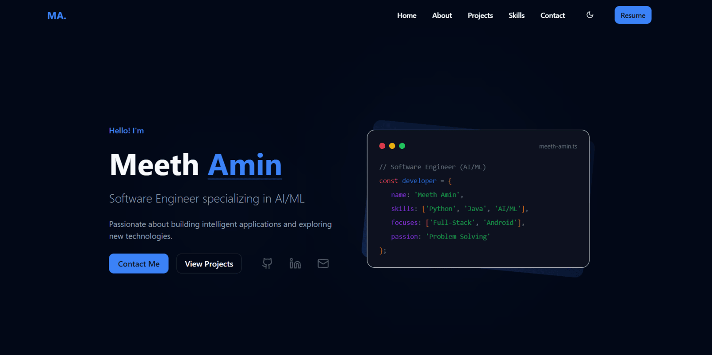

# 🚀 Meeth Amin – Software Engineer Portfolio

[](https://meethcodes.github.io)
[](https://github.com/meethcodes/meethcodes.github.io)


[](LICENSE)

---



## ✨ Overview

Welcome to the personal portfolio of **Meeth Amin**, a passionate Software Engineer with a specialization in **Artificial Intelligence & Machine Learning**. This portfolio showcases my journey, skills, projects, and passion for building intelligent applications with a modern tech stack.

---

## 🎯 Features

- 📌 **Dynamic Content Sections** – About, Skills, Projects, and Contact.
- 💡 **Responsive UI** – Optimized across mobile, tablet, and desktop screens.
- 🎨 **Theme Support** – Toggle between Light, Dark, and Purple themes.
- ✨ **Smooth Animations** – Powered by Framer Motion.
- ⚡ **Performance Focused** – Lazy loading for a fast user experience.
- 📬 **Functional Contact Form** – Integrated with Web3Forms API.

---

## 🛠️ Tech Stack

| Category         | Tech Used                                    |
| ---------------- | -------------------------------------------- |
| Frontend         | React (TypeScript), Vite                     |
| Styling          | Tailwind CSS, Shadcn/UI                      |
| AI/ML            | Python, TensorFlow, PyTorch, Scikit-learn    |
| Animations       | Framer Motion                                |
| Form Handling    | Web3Forms API                                |
| Linting/Format   | ESLint                                       |

---

## ⚙️ Getting Started

> To run this project locally, follow these steps:

### 🔧 Prerequisites

- Node.js v16+
- npm or yarn

### 🚀 Installation & Development

```bash
# Clone the repository
git clone [https://github.com/meethcodes/meethcodes.github.io.git](https://github.com/meethcodes/meethcodes.github.io.git)
cd meethcodes.github.io

# Install dependencies
npm install

# Start development server
npm run dev